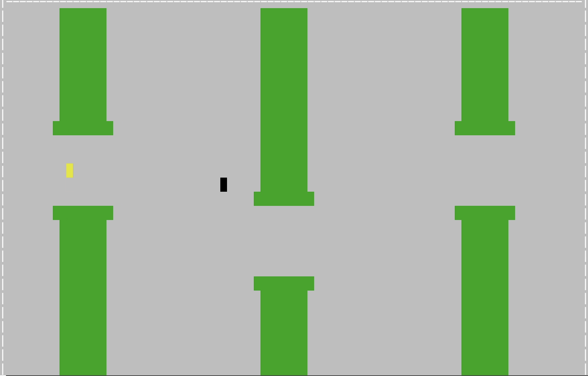
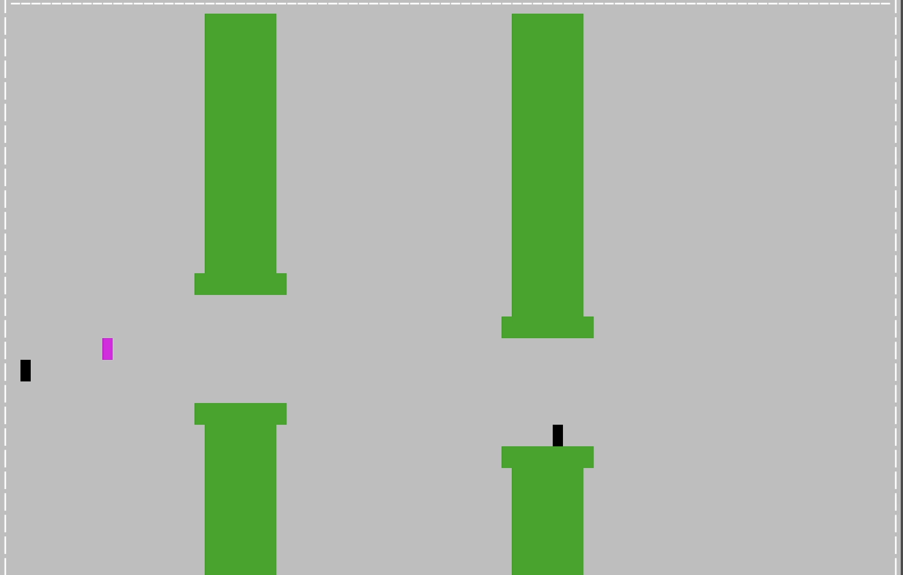

# Flappy-Block

Hi !!:wave: Welcome to our game project "Flappy Block":icecream:

We are **Liu Yitao** and **Zhang Yuxiang** :nerd_face:

Here are some introductions about our game:popcorn: Hope you can enjoy it! :beer:


## 1. Introduction

One day :cityscape: , a dog named  BAILEY :poodle: was caught in a factory:factory: and packed into a magical cardboard box:package: . It is pretty difficult for him to escape from the box, so he decides to use the magic of this box to run this strange factory.

**1.1: Strange factory:**

* There are countless **moving walls** in this factory. They are called "obstacles". Fortunately, **each wall has a gap**, but the **position of the hole is random**. Over time, the factory automatically controls the wall to speed up. Players need to **control the jumping trajectory of the carton** to make the carton **through these gaps**. **Note that anything that touches any wall will be grabbed back to the starting point.**:beers:

* Here is a possible situation:

  Players should control the box by using 'space' to pass through the gaps in the walls from left to right. **Whether it hits obstacles or the upper and lower boundaries will die.**

  

**1.2: Magic time:**

* Feel difficult? Magic time will help you!!! During the Magic time, all obstacles will disappear :P

* Here is something about it you have to know:
  1. Press **'s'** during the game to use it
  2. The effect will only **last for a few seconds**
  3. The number of times you can use will be reduced by 1 each time you use it, and your remaining times can be viewed in the "Magic numbers" in the upper right corner of the game. Every once in a while you will get an extra chance

**1.3: Black box:**

* A black box is a weird thing, if you touch it or pass around it, **your gravitational field will reverse!!**

* Here is something about it you have to know:

  1. It will be **randomly generated** in the map. no fixed time and no fixed place :(
  2. Gravity field reversal means that if you do nothing, the block **"free-falls" upwards**, and only **"jumps" downwards when you press space**.
  3. If you accidentally touch it, don't worry, its effect will **only last for a few seconds**, after a few seconds, your gravity field will return to normal. : )
  4. If your gravity field is reversed, the color of the block will change from yellow to rose red (pictured below). After a few seconds, your color will change back to yellow and the gravity field will return to normal

  

## 2. A list of features that we plan to implement

1. Randomly generate the locations of the wall's gaps. ( Requirement 1 covered )
2. Linearly increases walls movement speed.
3. Using the space bar to control the jumping of the carton.
4. Function that could control the movement of the box and print it out.
5. Individual files to control the functions, including printing the box and walls, control the movement of box, random number generation, ranking the scores, etc.  ( Requirement 5 covered )
6. Use data structures like array to store the game board and the wall position. ( Requirement 2 covered )
7. Use dynamic memory to set up a ranking list(unknown length) for the history of scores. ( Requirement 3 covered )
8. Use file input to use the random wall position which is stored in another file; use file output to output the score to the ranking file for ranking. ( Requirement 4 covered )


## 3. How to Start

To start the game:

* Compiled on Ubuntu Linux 18.04(maybe)
* Quick start: ``./main``
* If there are some warning, try to: (There will be several errors during compilation, please ignore it, it will not affect the compilation result)

````
make clean
make main
./main
````

 

## 4. Other things

* we used a non-standard C/C++ libraries named "conio". We use it to determine whether there is data in the buffer, in other words, whether we have input.

## 5. Introduction video

[output.mp4](https://connecthkuhk-my.sharepoint.com/:v:/g/personal/u3594786_connect_hku_hk/EVA_i-B8g5hKo0-8WmtmWF8BAWwDyIdBnFmYlM_2G_LWcA?e=XYMsT6)

**Hope you can enjoy it!!!!**
